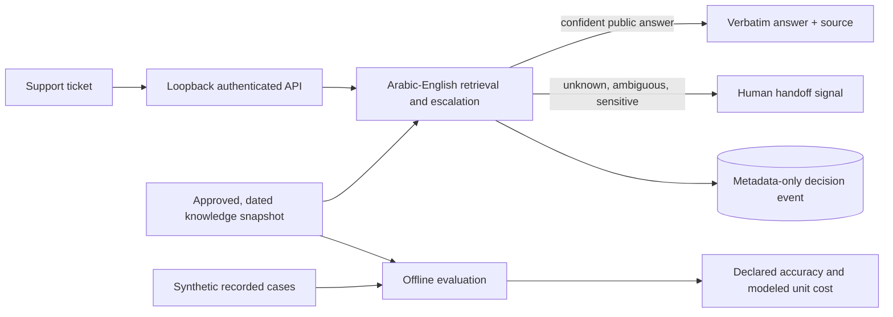

# A2Z Resolution Engine

An Arabic–English customer-support resolution kernel that answers only from approved knowledge, cites its source, and escalates ambiguous, unknown, account or payment requests. It includes an authenticated loopback API, metadata-only decision events, and a recorded-case evaluation command.

**Release boundary:** this is an extractive baseline, not an LLM agent or a deployed customer helpdesk. It does not claim that an answer resolved a customer's issue. The bundled knowledge, tickets, acceptance labels, and costs are fictional.



## Run the local evaluation

```bash
python3 -m venv .venv
. .venv/bin/activate
python -m pip install -e .
resolution-evaluate examples/knowledge.synthetic.json examples/cases.synthetic.json
python -m unittest discover -s tests -v
```

The six-case synthetic fixture yields three answers and three escalations. Its `$2.3100` modeled cost per declared accepted answer is **invented**, derived from two declared acceptances and fictional per-case/escalation costs. It is not a customer result or a price quote.

## Run the local API

```bash
export RESOLUTION_ENGINE_KEY='replace-with-a-random-key-of-at-least-32-characters'
resolution-engine --knowledge examples/knowledge.synthetic.json \
  --db /tmp/a2z-resolution-events.sqlite3 --host 127.0.0.1 --port 8789
```

From another terminal:

```bash
curl -sS http://127.0.0.1:8789/v1/resolve \
  -H "Authorization: Bearer $RESOLUTION_ENGINE_KEY" \
  -H 'Content-Type: application/json' \
  --data '{"id":"demo-1","locale":"ar","text":"ازاي اشوف دليل استخدام المنتج"}'
```

The server binds only to a numeric loopback IP. A remote pilot needs customer-controlled TLS, identity, rate limiting, monitoring, retention policy and a real human handoff integration. Do not place real support content in the public fixtures. The SQLite event table stores a keyed hash of ticket ID, decision, reason, article ID, latency, and knowledge digest; it does not store ticket text or answers. Protect the database and gateway key regardless.

## Product direction

First validate the extractive baseline on a consented, read-only support export. Then add a customer-approved knowledge ingest workflow, authenticated reviewers and human handoff. A model-backed answer adapter can be tested against the same locked cases, but should not bypass source, ambiguity, sensitive-action, or acceptance gates. Integrate the measured pilot with [Outcome Fabric](https://github.com/AAH20/outcome-fabric) for independent accepted-resolution economics, [GPU Inference Platform](https://github.com/AAH20/gpu-inference-platform) for private inference, and [AI Switchboard](https://github.com/AAH20/openai-to-vllm-nvidia-nim-migration) for migration. Those integrations are **not implemented** in this release.

The OSS layer keeps the retrieval/escalation baseline, API contract, evaluation format and synthetic examples inspectable. A commercial service can deliver private connectors, knowledge operations, supervised model adaptation, deployment, service monitoring and support under a customer contract. See [architecture and pilot gates](docs/ARCHITECTURE.md).

For implementation or a consented pilot, see [A2Z SOC](https://a2zsoc.com/).
