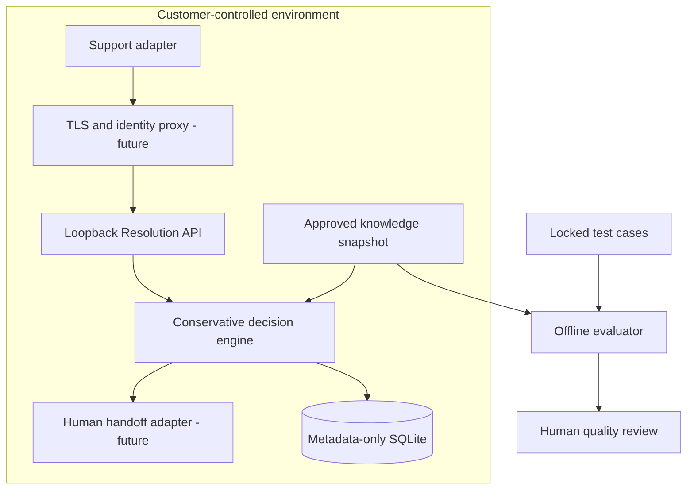

# Architecture and pilot gates

## Current components

1. **Versioned knowledge snapshot.** Each article has an ID, Arabic or English locale, approved question variants, verbatim answer, HTTPS source, approval boolean and expiry date. Only approved, unexpired articles are eligible. The example sources use `example.invalid` and are fictional.
2. **Conservative decision engine.** Unicode normalization includes Arabic letter variants and diacritics. Token overlap ranks articles within the ticket's locale. A score below 0.6, a near-tie within 0.15, empty context, or account/payment terms yields an escalation. Answers are returned verbatim from one article. This is a transparent retrieval heuristic; its thresholds are not calibrated on customer data.
3. **Loopback API.** `POST /v1/resolve` requires a bearer key; `GET /health` reports process liveness. Requests are capped at 16 KiB and ticket text at 4,096 characters. The server does not log prompts or responses. A successful API answer is provisional and reports `customer_acceptance=NOT_MEASURED`.
4. **Metadata event store.** SQLite stores decision metadata and a keyed ticket-ID hash. An event-write failure returns `503` rather than serving an unrecorded decision. It has no HA or event retention manager.
5. **Recorded-case evaluator.** A synthetic suite declares expected decisions and acceptance, plus per-case and escalation costs. The result reports declared-label accuracy and modeled cost per declared accepted answer. It cannot validate real customer acceptance or savings.

## First customer pilot

Choose one low-risk workflow, such as product documentation questions, with a customer who can provide a permitted export and approved knowledge pages. Lock a test set before tuning, split development and holdout cases, and include Arabic dialect and English phrasing, ambiguous queries, expired policy, PII, payment and account-action cases. Have customer reviewers label proposed answers and seven-day repeat contacts. Compare accepted-resolution rate, false answers, escalation precision, repeat contacts, reviewer time and all-in cost against the current process. No live traffic until authentication, monitoring, human handoff, deletion/retention and rollback drills are exercised. Begin with a small consented cohort and allow the customer to stop routing immediately.

## Explicit limitations

The release has no LLM inference, semantic embeddings, RAG connector, ticketing-system connector, live handoff, authenticated reviewer, consent verifier, automatic PII redaction, multilingual quality claim, real cost ledger, or production deployment. Keyword-sensitive escalation can miss paraphrases; broad false escalations are also possible. A real pilot must test both failure modes before expanding scope. Do not use this release for refunds, payments, account changes, identity verification, health, legal, or other consequential decisions.
