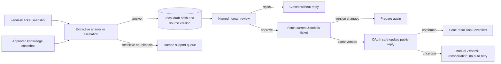

# Human-reviewed Zendesk pilot path

The deployment module is a narrow operator-run pilot tool. It uses a pinned, approved knowledge snapshot and a Zendesk ticket snapshot. A reviewer must explicitly approve an exact answer before any public reply can be sent. It does not authenticate the reviewer, ingest ticket streams, establish customer resolution, or perform billing.



## Local dry run

From the repository root, set a local key of at least 32 characters and keep the SQLite file outside the repository:

```bash
export RESOLUTION_ENGINE_KEY='replace-with-a-private-random-value-of-32-plus-chars'
PYTHONPATH=src python3 -m resolution_engine.deploy \
  --knowledge examples/knowledge.synthetic.json \
  --db /tmp/a2z-resolution-pilot.sqlite3 \
  prepare --ticket-file examples/zendesk-ticket.synthetic.json --locale en
```

The response contains `draft_id`, exact draft answer, source URL, and `PENDING_REVIEW`. Review it, then run:

```bash
PYTHONPATH=src python3 -m resolution_engine.deploy \
  --knowledge examples/knowledge.synthetic.json \
  --db /tmp/a2z-resolution-pilot.sqlite3 \
  review --draft-id YOUR_DRAFT_ID --reviewer 'Named support operator' --decision approve
```

`summary` returns draft-state counts and separately labeled operator-declared outcome counts. It deliberately returns `verified_accepted_resolutions: null`. After a confirmed send, an operator may record one `ACCEPTED`, `REWORK`, or `UNRESOLVED` declaration using `outcome --draft-id ... --reviewer ... --status ...`. This declaration is not authenticated customer acceptance. Do not treat an answer, approval, or sent reply as a resolved customer issue.

## Consented Zendesk send

Use a customer-authorized OAuth access token scoped to the pilot. The client requests one ticket and, only after review, updates that same ticket with `safe_update: true`, the original `updated_stamp`, and a public comment. Zendesk documents [safe ticket updates](https://developer.zendesk.com/documentation/ticketing/managing-tickets/creating-and-updating-tickets/) and [ticket comments](https://developer.zendesk.com/api-reference/ticketing/tickets/ticket_comments/). Do not use the synthetic ticket ID with a real account. For a commercial app, implement Zendesk's OAuth authorization flow rather than asking customers to share account API tokens; see [Zendesk authentication guidance](https://developer.zendesk.com/documentation/authentication/).

With authorization, `fetch-prepare --ticket-id REAL_TICKET_ID --subdomain CUSTOMER_SUBDOMAIN --locale en` fetches one ticket over the Zendesk API and prepares a draft locally. It does not write to Zendesk. Review the draft with the separate `review` command before considering a send.

```bash
export ZENDESK_OAUTH_TOKEN='customer-authorized-oauth-token'
PYTHONPATH=src python3 -m resolution_engine.deploy \
  --knowledge /secure/path/approved-knowledge.json \
  --db /secure/path/pilot.sqlite3 \
  send --draft-id REVIEWED_DRAFT_ID --ticket-id REAL_TICKET_ID --subdomain CUSTOMER_SUBDOMAIN
```

The same local key must be used for preparation and send because the database stores a keyed ticket hash rather than a raw ticket ID. A changed ticket or knowledge snapshot blocks send. After a timeout or ambiguous Zendesk response, inspect the ticket in Zendesk before taking any further action; the draft stays `UNCERTAIN_RECONCILE` and cannot be resent by this tool.

## Production release gates

1. Obtain the customer’s written pilot scope and OAuth authorization. Secure the local key, token, approved knowledge and database; use a restricted operator host and an encrypted volume.
2. Replace local bearer tokens with enterprise authenticated reviewer identities and controlled sessions. The [Resolution Relay local console](RESOLUTION_RELAY.md) supplies separate operator and reviewer tokens with an exact-draft preview, while the CLI still accepts a reviewer name as text. Keep the sender on a separate role and host.
3. Add ticket ingestion with cursor checkpoints, rate-limit handling, retention controls, and sensitive-data review. The current `prepare` command takes a single local ticket snapshot; it never synchronizes a helpdesk.
4. Add recorded customer follow-up and human adjudication under a locked measurement protocol. Export consented evidence to Outcome Fabric and measure accepted resolutions, rework, escalations and total delivery cost.
5. Test operational recovery, Zendesk permission changes, conflict responses, duplicate events and incident procedures with the customer before any unattended operation.

The public fixture is an implementation test, not a performance result. The local send path is intentionally one-at-a-time and human-triggered. No real customer has yet accepted a result through this repository.
