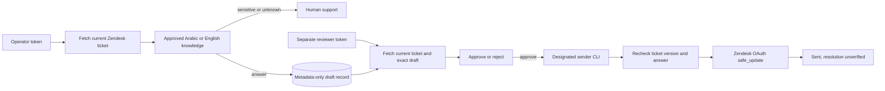

# Resolution Relay operator console

Resolution Relay is a local operator interface on top of the existing A2Z Resolution Engine and its Zendesk pilot path. It is designed for a **supervised, one-ticket-at-a-time pilot**, not unattended production automation.



The console has no send API. The operator token can prepare; the reviewer token can review. An approval requires that reviewer to preview the same current ticket and draft in the running process. Reviewer identity is a configured label bound to a distinct bearer token, **not** enterprise SSO. The metadata-only queue omits raw ticket IDs, descriptions, and answer text. Ticket content appears transiently in the browser only for preparation and preview. Protect the browser session and host accordingly.

## Local synthetic walkthrough

Generate your own secrets; do not copy the example strings below into a shared system. Use a fresh temporary SQLite path outside the repository.

```bash
export RESOLUTION_ENGINE_KEY="$(python3 -c 'import secrets;print(secrets.token_urlsafe(48))')"
export RELAY_OPERATOR_TOKEN="$(python3 -c 'import secrets;print(secrets.token_urlsafe(48))')"
export RELAY_REVIEWER_TOKENS="$(python3 -c 'import json,secrets;print(json.dumps({"Reviewer A":secrets.token_urlsafe(48)}))')"
PYTHONPATH=src python3 -m resolution_engine.relay \
  --knowledge examples/knowledge.synthetic.json \
  --db /tmp/resolution-relay-demo.sqlite3 \
  --ticket-file examples/zendesk-ticket.synthetic.json
```

Open `http://127.0.0.1:8790/`. Enter the operator token and prepare ticket `101` in English. Copy the resulting draft ID. Then enter the reviewer token from `RELAY_REVIEWER_TOKENS`, preview ticket `101` with that draft ID, and approve or reject. The synthetic mode has no send path.

## Consented Zendesk pilot

With a customer-authorized Zendesk OAuth token, run with `--subdomain CUSTOMER_SUBDOMAIN` in place of `--ticket-file` and set `ZENDESK_OAUTH_TOKEN` in the server's restricted environment. The server binds to `127.0.0.1` and does not serve remotely. Keep operator and reviewer tokens separate. Do not expose this console on a public interface; a remotely operated pilot needs TLS, customer identity, CSRF/session protection, rate limits, retention controls, secret management, and an audited deployment boundary.

Approval alone cannot send. A designated sender runs the existing `resolution-deploy send` command with the same database and key; it fetches the ticket again, rejects version drift, uses Zendesk `safe_update`, and leaves ambiguous network outcomes for manual reconciliation. See [the deployment guide](DEPLOYMENT.md).

## What to measure before expanding

Record eligible tickets, draft rate, escalation rate, reviewer rejection rate, approved sends, customer-confirmed outcomes, reopen rate, rework, median review time, and total cost per accepted resolution. Segment by language, topic, and case complexity. Do not use synthetic fixture figures as a customer performance or ROI claim.
